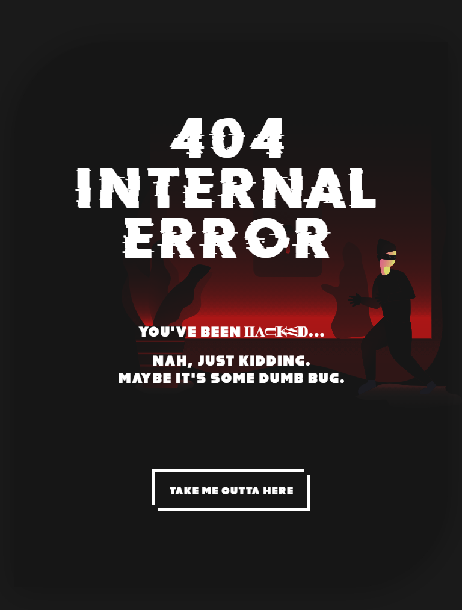
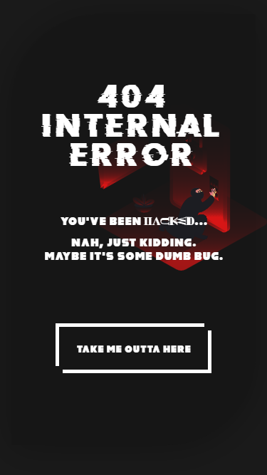

  <h1>404 Not Found (Hacked Theme)</h1>
  
A little challenge to improve my responsive design/development.

  <h3>
    <a href="https://hackederror.netlify.app">Demo</a>
     | 
    <a href="https://dribbble.com/shots/15088477-404-error-hacking-theme">Design</a>

## 📋 Table of Contents

- [Overview](#overview)
  - [Built With](#built-with)
- [Features](#features)
- [Acknowledgements](#acknowledgements)

## 🎨Overview

  
💻 Desktop version

  
📺 Tablet version

  
📱 Mobile version

## 👨‍💻 Built With

- HTML
- CSS
